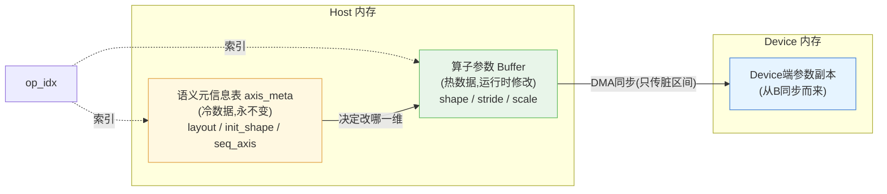

### **推荐"单独维护、并行存储"——把语义元信息(AxisSemantic)与算子参数Buffer解耦,放在独立的元信息表中,通过算子索引一一对应。**

下面从设计原则、对比分析和最终方案三个角度展开。

---

### **核心结论先行**

把 `init_shape`、`seq_axis`、`layout` 这类**初始/语义信息**放在**独立的元信息表(host端)**,而不要塞进算子参数结构体(会被同步到device的Buffer)。两者通过同一个 `op_idx` 索引绑定。

---

### **两种方案对比**

| 维度 | 方案A:塞进参数结构体 | 方案B:单独维护(推荐) |
|---|---|---|
| **Device Buffer体积** | 每算子多几十字节,N层模型累计MB级浪费 | Buffer只存Kernel真正需要的参数,最小化 |
| **DMA传输开销** | 每次同步都要传输这些"不变量",浪费带宽 | 只传真正变化的字段,可配合脏区间优化 |
| **Kernel侧污染** | Device Kernel能"看到"它根本不用的字段,易引发误用 | Kernel只看到执行所需参数,职责清晰 |
| **修改频率匹配** | 高频变化的Shape与永不变化的init_shape混在一起 | 冷热数据分离,符合数据访问局部性 |
| **可扩展性** | 新增语义信息(如新的axis角色)要改结构体并重新对齐 | 只改Host端表,Buffer布局零影响 |
| **跨设备一致性** | 元信息也被同步到Device,但Device用不上 | Host侧独占,无跨设备同步问题 |
| **调试便利性** | 元信息混在二进制Buffer里,排查时要解析整段 | 元信息是结构化的Host对象,可直接打印 |

---

### **为什么"分离"是更好的设计?**

**第一,数据的"温度"不同。** 算子参数中的 Shape、stride 是**热数据**——每次推理步都可能变;而 `init_shape`、`layout`、`seq_axis` 是**冷数据**——加载完模型后永不改变。把冷热数据混在一起,违背了"按访问频率分区存储"的基本原则,会导致每次同步都把冷数据也搬运一遍。

**第二,数据的"归属"不同。** 算子参数Buffer是**Host与Device的共享契约**——它的存在意义就是被Device端的Kernel读取执行。而语义元信息是**Host侧的调度知识**——它只服务于"运行时如何决定改哪一维"这个Host侧逻辑,Device Kernel根本不需要知道"这一维原本叫SeqLen"。把只有Host用的东西放进Device能看到的Buffer,既浪费空间,又模糊了职责边界。

**第三,数据的"生命周期"不同。** 参数Buffer可能因为模型重载、权重切换、多Batch并行等原因被重建或交换,但语义元信息是模型结构本身的属性,只要模型架构不变,这份元信息就一直有效。分离后,Buffer的频繁重建不会影响元信息,反之亦然。

---

### **推荐的存储布局**

```cpp
// ========== Host侧:语义元信息表(只读、永不传Device) ==========
struct AxisSemantic {
    AxisRole layout[MAX_RANK];
    int8_t   seq_axis;
    int8_t   kv_len_axis;
    int8_t   batch_axis;
    int32_t  init_shape[MAX_RANK];
    int8_t   rank;
    uint32_t dynamic_axes_mask;
};
std::vector<AxisSemantic> axis_meta;        // 索引 = op_idx,模型加载时填充

// ========== Host/Device共享:算子参数Buffer ==========
struct MatMulParam {           // 只放Kernel真正需要的字段
    int32_t op_type;
    int32_t shape[MAX_RANK];   // ← 唯一会被运行时修改的部分
    int32_t stride[MAX_RANK];
    // 不再包含 init_shape / layout / seq_axis
};
uint8_t* param_buffer;          // 连续Buffer,按需DMA到Device
```

运行时通过同一个 `op_idx` 同时索引两张表:

```cpp
void update_seq_len(int op_idx, int new_seq_len) {
    const auto& sem = axis_meta[op_idx];                  // Host侧查语义
    auto* p = get_param_view<OpParam>(op_idx);            // Buffer视图
    p->shape[sem.seq_axis] = new_seq_len;                 // 只改热数据
    mark_dirty(op_idx, offsetof(OpParam, shape));         // 记录脏区间
}
```

---

### **架构示意**



注意这张图里的关键信息流:**元信息表只在Host内部参与决策,从不跨越Host-Device边界**;参数Buffer才是真正承载"需要被Kernel执行"的数据,且只同步发生变化的部分。

---

### **什么情况下可以放进结构体?**

凡事有例外。如果满足下面**全部条件**,把少量元信息塞进参数结构体也是可以接受的:

- 该字段Device Kernel确实需要读取(例如某些Kernel需要根据layout决定循环顺序)
- 字段大小很小(几个字节)
- 字段在模型加载后确实不再变化(可作为常量传入)

但即便如此,**`init_shape` 这种"用于Host侧校验和恢复"的字段也不应该混进去**——它是纯粹的Host侧调度知识,放进Buffer就是单纯的浪费。

---

### **一句话总结**

> **参数Buffer装"算子需要做什么",元信息表装"调度器需要知道什么"——前者跨越Host-Device边界,后者只服务于Host侧决策,二者解耦才能各司其职。**

具体到你框出的 `init_shape` 字段,它的作用是**Host侧校验当前Shape是否合法、以及在异常时恢复初始状态**,Kernel根本不会读它,所以毫无疑问应该放在独立的元信息表中。

*内容由 AI 生成仅供参考*