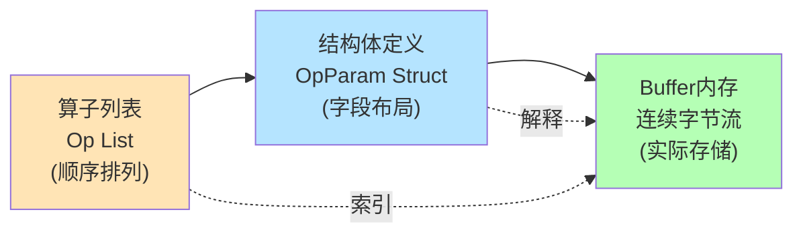
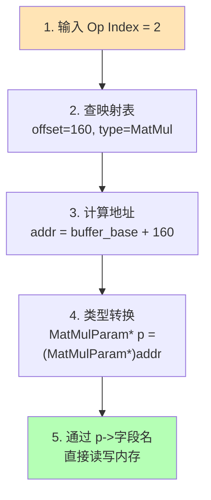
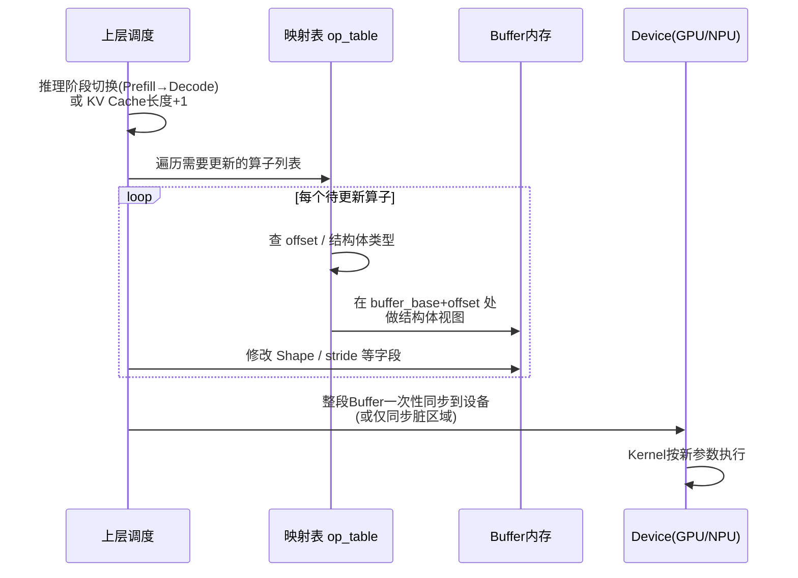

### **可以将这一过程讲述为"算子参数结构体 ↔ Buffer内存区域"的映射与原地修改:先建立算子列表与内存偏移的索引表,再通过结构体指针视图直接读写对应内存,实现零拷贝的Shape参数动态更新。**

下面给你一份可直接用于PPT讲解的内容框架,包含叙述逻辑、结构图、内存布局图和示例代码,层层递进。

---

### **整体讲解思路**

讲这部分内容,建议按"**是什么 → 为什么这样设计 → 怎么映射 → 怎么修改 → 有什么好处**"五步推进。核心是让听众理解:**算子参数不是散落的变量,而是一段连续Buffer上按结构体排布的"内存视图",修改参数 = 修改这段内存的特定字节**。

---

### **P1 · 设计目标:为什么用Buffer承载算子参数?**

在推理引擎中,每个算子都有自己的参数(Shape、stride、scale、轴信息等)。如果用零散的对象存储,会面临三个问题:**内存碎片化**、**主机到设备传输代价高**、**动态修改成本大**。

因此工程上常用的做法是:**将所有算子的参数按顺序打包到一段连续Buffer中**,每个算子的参数对应Buffer里的一段区域,用结构体来描述这段区域的字段布局。这样做的好处是——参数可以**一次性DMA上传到设备**,运行时只需**就地(in-place)修改少量字节**就能完成动态Shape更新。

---

### **P2 · 核心概念:三层对象关系**



三者的角色可以这样理解:**算子列表**提供"第几个算子"的顺序索引;**结构体**提供"这段内存里每个字段在哪、占几个字节"的解释规则;**Buffer**则是真正持有数据的物理载体。三者结合,才能完成"按算子定位 → 按字段解释 → 按需修改"的完整闭环。

---

### **P3 · 内存布局示意图**

假设有4个算子顺序排列,每个算子参数结构体大小可能不同(Conv参数比ReLU参数大),Buffer的布局如下:

```
Buffer起始地址 ──►
┌─────────────────┬──────────┬─────────────────┬──────────┬─►
│  Op0: Conv参数   │ Op1:ReLU │  Op2: MatMul    │ Op3:Add  │ ...
│  (sizeof=128B)  │ (=32B)   │  (sizeof=96B)   │ (=32B)   │
└─────────────────┴──────────┴─────────────────┴──────────┴─►
  offset=0          offset=128  offset=160        offset=256
```

每个算子在Buffer中的**起始偏移 offset**和**大小 size**,共同确定了它的内存区域。这个映射关系通常用一张表维护:

| Op Index | Op Type | Offset | Size | 对应结构体 |
|---|---|---|---|---|
| 0 | Conv | 0 | 128 | `ConvParam` |
| 1 | ReLU | 128 | 32 | `ReluParam` |
| 2 | MatMul | 160 | 96 | `MatMulParam` |
| 3 | Add | 256 | 32 | `AddParam` |

---

### **P4 · 结构体定义示例**

以一个简化的MatMul算子参数结构体为例,展示字段如何对应内存:

```cpp
struct MatMulParam {
    int32_t op_type;        // 偏移 0,  4B  算子类型标识
    int32_t M;              // 偏移 4,  4B  输出行数
    int32_t N;              // 偏移 8,  4B  输出列数
    int32_t K;              // 偏移 12, 4B  规约维度
    int32_t input_shape[4]; // 偏移 16, 16B 输入张量Shape
    int32_t output_shape[4];// 偏移 32, 16B 输出张量Shape
    int32_t stride[4];      // 偏移 48, 16B 步长信息
    int32_t reserved[8];    // 偏移 64, 32B 预留对齐
};  // 总大小 96B
```

字段在结构体里的**编译期偏移**(可用 `offsetof` 获取)就是它在Buffer里相对该算子起始位置的偏移。这种"结构体即内存布局"的设计,是后续映射与修改的基础。

---

### **P5 · 映射过程:Buffer ↔ 结构体视图**

映射的本质是**用结构体指针"覆盖"在Buffer的某段内存上**,从而把原始字节流"翻译"成可读写的字段:



对应的C++代码非常简洁:

```cpp
// 1. 根据算子索引拿到Buffer内偏移
auto& entry = op_table[op_idx];          // {offset, size, type}
void* addr  = buffer_base + entry.offset;

// 2. 按算子类型做结构体视图
MatMulParam* p = reinterpret_cast<MatMulParam*>(addr);

// 3. 像访问普通对象一样读写
p->M = new_M;
p->input_shape[1] = new_seq_len;
```

注意,这里**没有任何拷贝**,`p` 只是Buffer内存的一个"别名视图",修改 `p->M` 就等价于修改Buffer第164~167字节。

---

### **P6 · 动态修改参数的完整流程**

结合上一题讲过的动态Shape场景,完整流程如下:



这个流程的关键点是:**修改是原地的、批量同步是高效的**。如果只有少量字段变化,还可以记录"脏区间"(dirty range),只传输被修改的那几个字节,进一步降低主机到设备的传输开销。

---

### **P7 · 这种设计的优势**

讲解时建议把优势归纳为四点,听众更容易记住:

**第一,内存连续、传输高效。** 所有算子参数在一段Buffer里,可以一次DMA上传,避免了多次小数据传输的延迟。**第二,零拷贝修改。** 结构体视图直接落在Buffer上,改字段就是改内存,没有任何序列化/反序列化开销。**第三,结构清晰、可扩展。** 新增算子只需定义新的结构体并注册到映射表,Buffer布局自然扩展。**第四,便于版本化与持久化。** 整段Buffer可以直接dump到文件作为模型权重之外的"参数快照",加载时反向映射即可恢复。

---

### **P8 · 实现要点与注意事项**

在工程实现时,有几个容易踩坑的点需要特别强调:

- **内存对齐**:不同字段(尤其是向量化字段)对设备访问对齐有要求,结构体中需要适当 padding 或使用 `alignas`
- **字节序与平台一致性**:若Buffer跨设备/跨进程传递,需统一字节序(一般小端)
- **结构体版本管理**:结构体一旦改动会破坏旧Buffer的兼容性,建议预留 `reserved` 字段
- **越界保护**:修改前用 `offset + sizeof(Struct) <= buffer_size` 做边界检查
- **并发安全**:若多线程同时修改不同算子参数,需保证各算子内存区域不重叠(天然满足),但同步到设备的时机要协调

---

### **P9 · 一句话总结**

这套机制可以浓缩为一句话:**用"算子列表 + 偏移表"做索引,用"结构体"做解释,用"Buffer"做存储,从而把动态参数修改变成对一段连续内存的、有类型保护的、零拷贝原地写入**。

---

要不要我帮你针对某一页(比如P5的映射过程或P6的修改流程)再画一张更具体的内存字节级示意图?或者把示例代码扩展成一个完整的mini demo(包含算子注册、映射表构建、参数修改、Buffer同步)?

*内容由 AI 生成仅供参考*