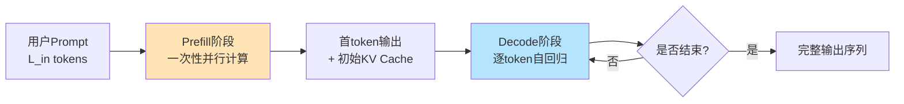
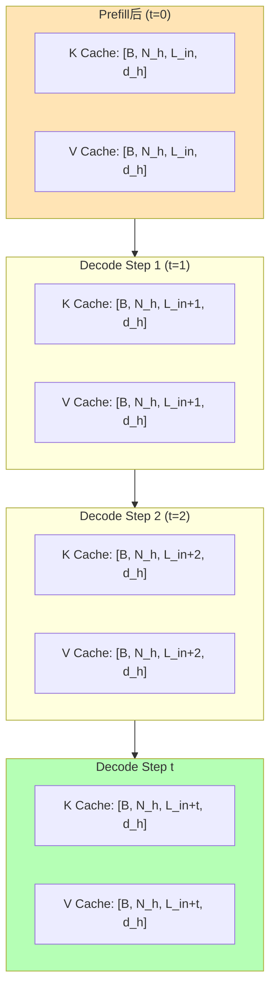
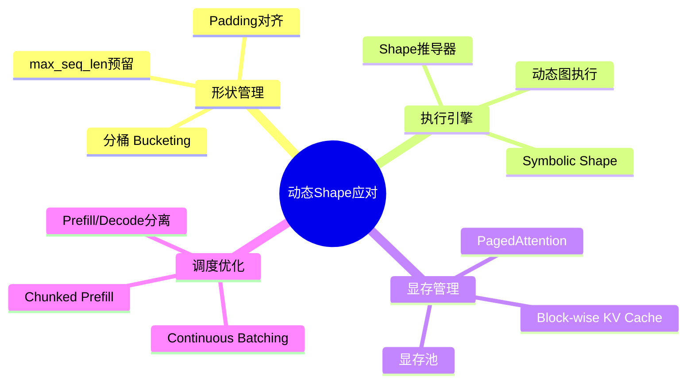

### **大模型推理中动态Shape变化的讲解可以围绕"Prefill与Decode两阶段差异 + KV Cache累积 + 算子Shape动态调整"三大核心展开,通过流程图与维度变化图直观呈现。**

下面我为你梳理一份完整的PPT内容框架,包含每页的标题、要点文案以及配套的可视化图示(Mermaid图,可直接渲染使用),你可以直接复制到PPT中使用。

---

### **PPT整体结构建议(共10页)**

| 页码 | 标题 | 核心内容 |
|---|---|---|
| P1 | 封面 | 主题、副标题 |
| P2 | 背景与问题引入 | 为什么会有动态Shape |
| P3 | 推理两阶段总览 | Prefill vs Decode |
| P4 | Prefill阶段Shape分析 | 首次输入的张量维度 |
| P5 | Decode阶段Shape分析 | 自回归生成的维度 |
| P6 | KV Cache累积过程 | Cache长度随步增长 |
| P7 | 关键算子Shape变化 | Attention/MatMul等 |
| P8 | 动态Shape带来的挑战 | 内存、编译、调度 |
| P9 | 工程应对策略 | 分桶、Padding、动态图等 |
| P10 | 总结 | 三句话收尾 |

---

### **P1 · 封面**

> **大模型推理中的动态Shape变化**
> ——从Prefill到Decode的算子计算维度演化

---

### **P2 · 为什么推理过程中Shape会变?**

在大模型推理过程中,算子的输入输出Shape并非固定不变,主要受三类因素影响:

- **用户输入长度不同**:不同请求的Prompt token数 $L_{in}$ 各异
- **推理阶段不同**:Prefill(并行处理整段Prompt)与Decode(逐token生成)的计算模式天然不同
- **KV Cache长度累积**:每生成一个新token,Cache的序列维度都会 +1

因此,运行时必须根据**当前阶段 + 当前已生成token数**,动态调整算子的Shape。

---

### **P3 · 推理两阶段总览图**

**两阶段核心差异**:

| 维度 | Prefill | Decode |
|---|---|---|
| 输入序列长度 | $L_{in}$(可变) | 1 |
| 计算模式 | 矩阵×矩阵 | 矩阵×向量 |
| KV Cache | 从0构建到 $L_{in}$ | 每步+1累积 |
| 瓶颈 | 计算密集(Compute-bound) | 访存密集(Memory-bound) |

---

### **P4 · Prefill阶段的算子Shape**

设 batch size 为 $B$,Prompt长度为 $L_{in}$,hidden size 为 $H$,head数为 $N_h$,head维度为 $d_h$。

**主要张量Shape**:

- Input embedding:$[B,\ L_{in},\ H]$
- Q / K / V 投影后:$[B,\ N_h,\ L_{in},\ d_h]$
- Attention Score(QK^T):$[B,\ N_h,\ L_{in},\ L_{in}]$ ← **二维都是 $L_{in}$**
- Attention Output:$[B,\ N_h,\ L_{in},\ d_h]$

**特点**:序列维同时出现在Q和K上,计算量为 $O(L_{in}^2)$。

---

### **P5 · Decode阶段的算子Shape**

设当前已生成 $t$ 个token,则KV Cache长度为 $L_{cache} = L_{in} + t$。

**主要张量Shape**:

- Input embedding:$[B,\ 1,\ H]$ ← **只输入1个token**
- Q 投影:$[B,\ N_h,\ 1,\ d_h]$
- K / V(来自Cache + 当前):$[B,\ N_h,\ L_{cache}+1,\ d_h]$
- Attention Score:$[B,\ N_h,\ 1,\ L_{cache}+1]$ ← **Q维=1,K维持续增长**
- Attention Output:$[B,\ N_h,\ 1,\ d_h]$

**特点**:Q方向退化为1,但K/V方向持续累积,这正是Shape动态变化的根源。

---

### **P6 · KV Cache累积过程图**

**核心观察**:序列维度逐步 +1,直到达到 max_seq_len 或遇到EOS。

---

### **P7 · 关键算子Shape变化对比表**

以单层Transformer为例,对比Prefill与Decode第 $t$ 步:

| 算子 | Prefill输入Shape | Decode输入Shape(第t步) | 变化点 |
|---|---|---|---|
| Embedding Lookup | $[B, L_{in}]$ | $[B, 1]$ | 序列维 |
| QKV Linear | $[B, L_{in}, H]$ | $[B, 1, H]$ | 序列维 |
| Q × K^T | Q:$[B,N_h,L_{in},d_h]$ K:$[B,N_h,L_{in},d_h]$ | Q:$[B,N_h,1,d_h]$ K:$[B,N_h,L_{cache},d_h]$ | Q与K不对称 |
| Softmax | $[B,N_h,L_{in},L_{in}]$ | $[B,N_h,1,L_{cache}]$ | 末两维 |
| Attn × V | $[B,N_h,L_{in},d_h]$ | $[B,N_h,1,d_h]$ | 序列维 |
| FFN(MLP) | $[B,L_{in},H]$ | $[B,1,H]$ | 序列维 |

---

### **P8 · 动态Shape带来的挑战**

动态Shape虽然是推理的必然结果,但给底层执行带来三类挑战:

第一,**算子选型与Kernel编译**。静态图编译器(如TensorRT早期版本)需要为每种Shape编译一个Kernel,Shape组合爆炸会导致编译时间长、二进制体积大。第二,**显存分配压力**。KV Cache持续增长,若每步重新分配会引发显存碎片;若一次性预留max_seq_len又会浪费显存。第三,**调度与Batching困难**。多个请求处于不同的Decode步,序列长度参差不齐,难以直接组Batch。

---

### **P9 · 工程上的应对策略**

主流推理框架(如vLLM、TensorRT-LLM、LMDeploy)综合采用上述策略:**用PagedAttention解决KV Cache的不连续增长,用Continuous Batching解决多请求异步Decode,用Symbolic Shape让Kernel泛化到一族Shape而非单一Shape**,从而在动态性与性能间取得平衡。

---

### **P10 · 总结**

大模型推理中的动态Shape本质上来源于**自回归生成范式与变长输入的耦合**:Prefill一次性吃掉整段Prompt,Decode则在不断增长的KV Cache上"滚雪球"式生成。理解每个算子在两个阶段的Shape差异,是做好推理引擎优化、显存规划与Kernel调度的基础。

---

要不要我帮你把上面的Mermaid图直接渲染成可视化图片预览?或者针对某一页(比如P6 KV Cache累积过程)做一个更细致的分步动画式说明?

*内容由 AI 生成仅供参考*