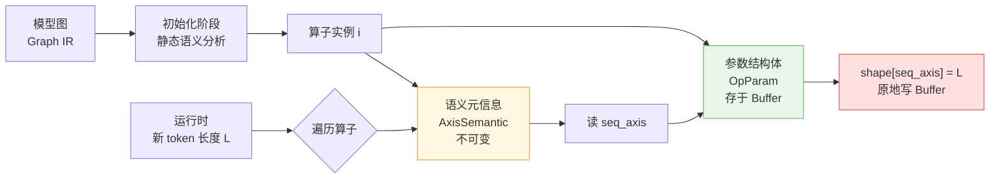

### **核心思路是:同一类算子在模型不同位置的"维度语义"不同,运行时无法仅凭当前Shape数值反推语义,因此必须在初始化阶段为每个算子实例记录一份"维度语义元信息"(Axis Semantic Meta),后续动态更新时按语义而非按位置去修改对应维度。**

下面给你一份可直接放进PPT的讲解内容,包含问题描述、图示和元信息设计方案。

---

### **P1 · 问题:为什么"看Shape猜含义"会失效?**

在Transformer类模型中,同一种算子(如RMSNorm、Reshape、Transpose)会在不同位置出现,但它们的输入张量**维度顺序**(layout)往往不同——这通常是由前置的permute/transpose算子造成的。例如:

| 算子位置 | 输入Shape | 维度含义(Layout) |
|---|---|---|
| 位置A:Attention前的RMSNorm | `[1, 64, 32, 128]` | `[B, SeqLen, HeadNum, HeadDim]` |
| 位置B:Attention内部某处RMSNorm | `[1, 32, 64, 128]` | `[B, HeadNum, SeqLen, HeadDim]` |

平常 SeqLen=64 时,两者数值不同,还能区分。但当**用户输入恰好是32个token**,两者输入Shape都变成 `[1, 32, 32, 128]`——此时光看数字,`dim=1` 到底是 SeqLen 还是 HeadNum?**完全无法判断**。

如果搞错了,动态修改时就会改错维度,导致后续算子计算异常。

---

### **P2 · 歧义场景图示**

### **P3 · 解决方案:为每个算子实例记录"维度语义元信息"**

既然运行时不能从数值反推,就必须在**模型初始化阶段(图编译期/图加载期)**,根据模型结构静态分析出每个算子实例的维度语义,把它作为不可变的元信息固化下来。这份元信息可以这样设计:

```cpp
struct AxisSemantic {
    // 1. Layout 描述:每一维的语义标签
    enum AxisRole { BATCH, SEQ_LEN, HEAD_NUM, HEAD_DIM, HIDDEN, KV_LEN, OTHER };
    AxisRole layout[MAX_RANK];        // 例如 A: {BATCH, SEQ_LEN, HEAD_NUM, HEAD_DIM}
                                       //      B: {BATCH, HEAD_NUM, SEQ_LEN, HEAD_DIM}
    
    // 2. 关键轴的位置(预计算好,运行时直接用)
    int8_t seq_axis;                  // A=1, B=2
    int8_t kv_len_axis;               // 仅Attention相关算子有效, 否则 -1
    int8_t batch_axis;                // 通常是 0
    
    // 3. 初始 Shape 快照(用于校验和恢复)
    int32_t init_shape[MAX_RANK];     // A: [1,64,32,128]   B: [1,32,64,128]
    int8_t  rank;
    
    // 4. 动态轴集合:标记哪些维度会随推理变化
    uint32_t dynamic_axes_mask;       // bitmask, 例如 {seq_axis} 对应 1<<seq_axis
};
```

这份元信息**和算子参数结构体并列存储**,在图加载时一次性填好,运行时只读不写。

---

### **P4 · 整体数据结构关系**



把这套机制叠加到上一题"Buffer + 结构体映射"的设计上,完整的运行时调用就变成了:

```cpp
void update_seq_len(int op_idx, int new_seq_len) {
    auto& sem  = axis_meta[op_idx];                     // 元信息(只读)
    auto* p    = get_param_view<OpParam>(op_idx);       // 结构体视图
    
    if (sem.seq_axis >= 0) {
        p->shape[sem.seq_axis] = new_seq_len;           // 按语义而非位置改
    }
    if (sem.kv_len_axis >= 0) {
        p->shape[sem.kv_len_axis] = new_seq_len + cache_len;
    }
    // ... 其他动态轴
}
```

注意这里的关键点:**修改逻辑对所有算子是统一的**,差异完全被封装在 `axis_meta` 里。位置A的 `seq_axis=1`,位置B的 `seq_axis=2`,同一段代码自然会修改不同的维度,**彻底避开了"靠Shape值猜含义"的歧义**。

---

### **P5 · 元信息从哪里来?三种获取途径**

工程上,这份元信息的来源通常是三者结合:

第一,**从模型结构推导**。在加载ONNX/HuggingFace模型时,根据算子在图中的位置(前后接的permute/transpose、reshape的目标形状)推断出当前的 layout。例如检测到 `Q @ K^T` 之前有一个 `permute(0,2,1,3)`,就能确定 K 的 layout 从 `[B,S,H,D]` 变成了 `[B,H,S,D]`。第二,**从模型配置文件读取**。一些框架会在模型 config 里显式标注每个算子的 layout,直接读即可。第三,**人工标注或模板化**。对于特定模型架构(如 LLaMA、Qwen),可以预先写好每一层各算子的 layout 模板,加载时按模板填充,这是最可靠也是工业界最常用的做法。

无论哪种方式,**关键是这份元信息必须在第一次推理之前就完成填写**,后续推理只查不改。

---

### **P6 · 一句话总结**

> **数值会变,语义不变。**
> 用 Shape 数值表达"当前是什么",用 AxisSemantic 元信息表达"应该改什么"——把"位置感知"从运行时前移到初始化期,从而让运行时的参数更新逻辑简洁、统一、且永不混淆。

---

讲到这里,你的整个故事链就完整了:**Prefill/Decode导致Shape动态变化(题1) → 用Buffer+结构体承载参数实现高效修改(题2-3) → 用语义元信息避免维度歧义(本题)**,三者层层递进、互为支撑,非常适合作为PPT的主线叙事结构。

要不要我帮你把这三部分整合成一份完整的PPT大纲(带页码、过渡话术和每页要点)?

*内容由 AI 生成仅供参考*