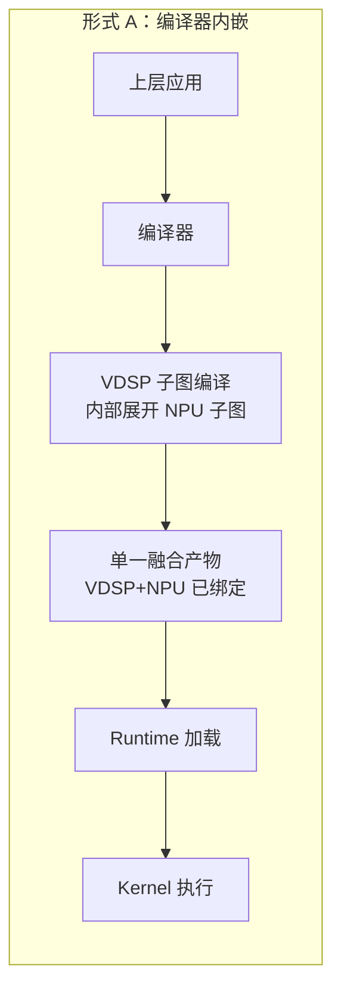
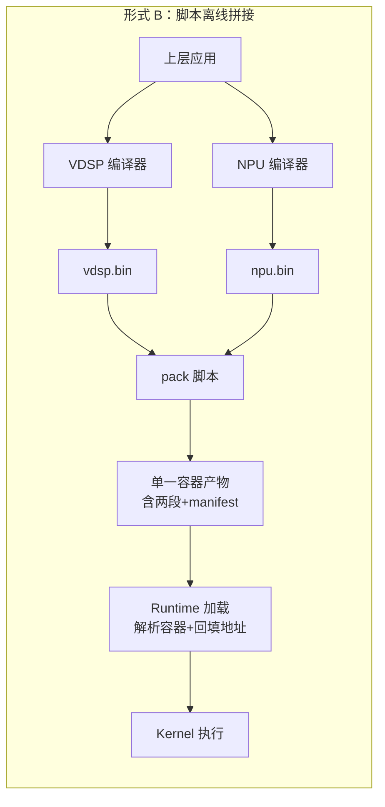
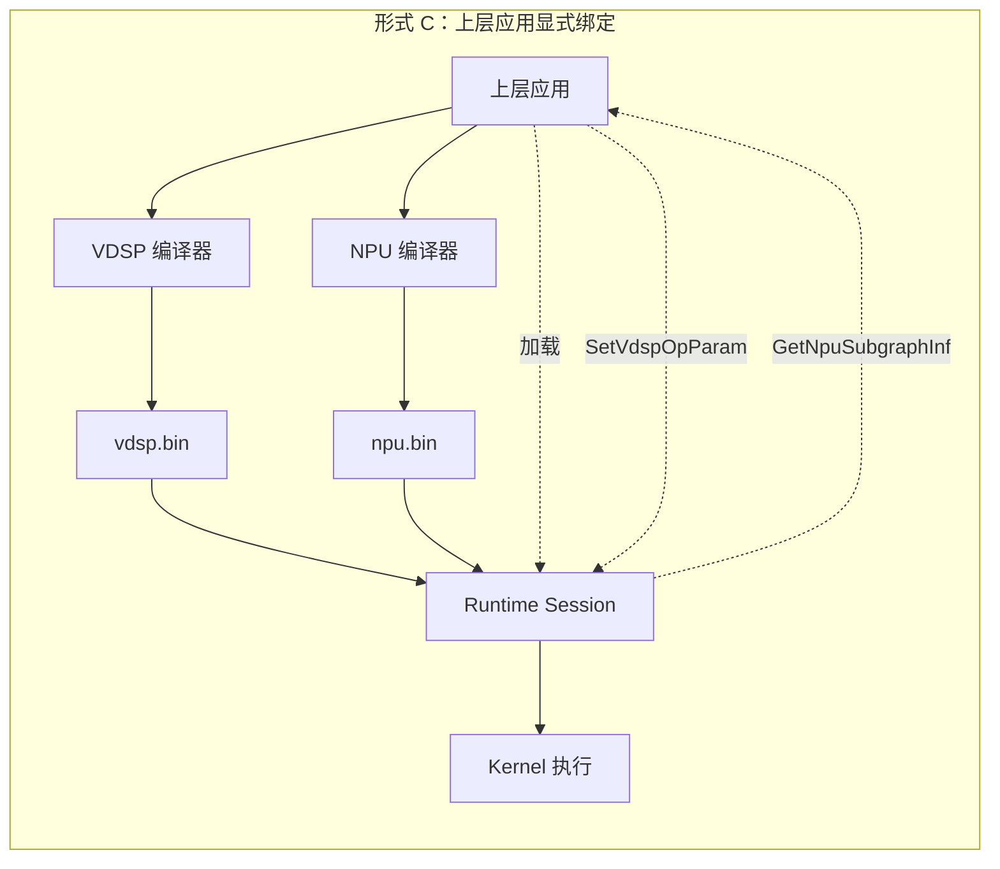

# 三种方式的全面对比

## 三种方式的架构示意

三张图的核心差异一眼可见：**绑定箭头出现在哪一层**——A 在编译器内、B 在脚本工具内、C 在上层应用内。

---

## 形式 A：编译器内嵌

### 优点

**使用形式最干净**：上层应用完全无感，加载一个模型、调一次 run() 就完成所有事，对最终用户体验最好。

**编译期可做全局优化**：编译器同时掌握 VDSP 算子的切分策略和 NPU 子图的指令流，理论上可以做跨子图的内存复用、调度优化、甚至是切分粒度的自适应。

**产物自包含**：单一产物就是完整可执行模型，不需要任何外部依赖、不需要任何运行时绑定动作，部署和分发最简单。

**版本一致性强制保证**：VDSP 和 NPU 部分被锁定在同一份产物里，不可能出现"VDSP 模型和 NPU 模型版本不匹配"的运行时错误。

**Runtime 改动最小**：Runtime 只需要按现有逻辑加载一个模型即可，不需要任何新增的查询、绑定、容器解析能力。

### 缺点

**严重破坏编译器分层**：当前编译器是"一算子一图"的清晰设计，让一个 VDSP 算子在内部展开为 NPU 子图执行流，相当于让编译器同时承担"算子编译"和"跨硬件图调度"两个职责，是一个根本性的架构改动。

**编译器需要理解两种硬件**：原本 VDSP 编译器只产参数、NPU 编译器只产指令流，现在 VDSP 编译器需要内嵌 NPU 编译器的能力（或者至少要能调用 NPU 编译器的产物），耦合度大幅提升。

**多对多共享变难**：你已经确认同一份 NPU 子图会被多个 VDSP 算子共享，编译器内嵌方式下要么每个 VDSP 算子各自内嵌一份（产物膨胀），要么编译器要做全局去重（进一步增加复杂度）。

**调试极其困难**：VDSP 部分和 NPU 部分被融合在一份产物里，出问题时无法独立验证哪一部分错了，必须从融合产物里反推。

**NPU 部分独立升级几乎不可能**：哪怕只是 NPU 子图微调（比如换一份性能更好的 shape 版本），也要重新跑一遍完整编译流程。

**编译器开发工作量大**：需要新增"算子内部子图展开"机制，需要新增跨硬件资源管理，需要重新设计 IR 来表达这种嵌套关系。

**未来再出现类似异构需求会持续侵蚀编译器**：今天是 VDSP 调 NPU，明天如果出现 VDSP 调 DMA、NPU 调专用加速器，编译器都要承担——分层一旦破坏就会持续坍塌。

---

## 形式 B：脚本离线拼接

### 优点

**上层使用形式与 A 相同干净**：单文件、单次 load、零业务改动，最终用户体验和形式 A 等价。

**编译器零侵入**：VDSP 编译器和 NPU 编译器各自保持原有的"一算子一图"设计，只需要扩展 OP Param 字段和 manifest 导出，分层完全保留。

**两份产物可独立调试**：拼接前的 vdsp.bin 和 npu.bin 都是合法的独立产物，可以分别用最小测试 harness 验证。

**多对多共享天然支持**：脚本拼接时只是把 NPU 大指令流作为一段 blob 嵌入，VDSP 算子通过名字索引访问，多个算子引用同一份子图毫无障碍。

**Runtime 改动小且通用**：Runtime 只需要新增"容器格式解析"和"按名字回填 OP Param"两个能力，逻辑简单。

**版本一致性可在 pack 阶段强制校验**：脚本拼接时可以校验 VDSP 算子声明的依赖名字是否在 NPU manifest 中存在、shape 是否匹配，把错误拦在离线阶段。

**升级路径平滑**：将来想要"形式 A 体验"也只是把 pack 步骤吸收进编译器尾部，不影响已有架构。NPU 部分单独升级也只需要重新跑一次 pack。

**工具链改动可控**：pack 脚本是纯文件级容器封装，不解析任何指令语义，开发和维护成本都很低。

### 缺点

**多了一个工具链环节**：构建流程从"两次编译"变成"两次编译 + 一次 pack"，CI/CD 流程要相应调整。

**脚本本身是新维护对象**：哪怕逻辑简单，脚本也需要版本管理、文档、测试。

**容器格式需要稳定**：一旦定义了容器格式，后续修改要考虑向后兼容，否则旧的拼接产物在新 Runtime 上会失效。

**拼接配置需要管理**："哪个 VDSP 算子依赖哪个 NPU 子图"这份配置要么写在 schema 里、要么写在 pack 命令行里，需要明确归属。

**对外部用户仍然是黑盒**：虽然内部开发可以独立调试两份产物，但对最终交付的客户/上层用户，单一产物依然不可拆解，调试支持需要额外的工具（比如一个 unpack 工具）。

**运行时灵活性受限**：拼接是离线动作，运行时不能动态替换 NPU 子图、不能根据情况选择不同的 NPU 模型版本。

**多 Session 共享 NPU 模型不便**：如果两个不同的 VDSP 模型都要用同一份 NPU 模型，每份产物里都要嵌一遍，存在冗余。

---

## 形式 C：上层应用显式绑定

### 优点

**编译器零侵入**：和形式 B 一样，VDSP 和 NPU 编译器保持各自的原有职责。

**Runtime 接口最通用**：新增的 `GetNpuSubgraphInfo` 和 `SetVdspOpParam` 是通用原子接口，不专门为"VDSP 调 NPU"设计，未来任何跨模型信息传递场景都能复用。

**调试最友好**：VDSP 模型和 NPU 模型始终独立存在，任何一方出问题都可以单独验证；绑定动作发生在上层应用代码里，可以打 log、打断点，路径完全透明。

**多对多共享最自然**：上层应用想让多少个 VDSP 算子引用同一份 NPU 子图都行，绑定逻辑在应用代码里完全自由。

**运行时灵活性最高**：可以根据运行时条件选择加载不同的 NPU 模型、可以热替换 NPU 模型、可以根据用户配置动态决定绑定策略。

**多 Session 共享天然支持**：同一份 NPU 模型可以被多个 Session 共享加载，不存在产物冗余。

**职责划分最清晰**：编译器只管编译、Runtime 只管执行 + 提供查询/设置原语、上层应用负责跨模型编排——每一层职责单一，符合分层架构原则。

**可观测性最好**：绑定关系在应用代码里显式表达，看代码就知道谁绑了谁，不需要去翻产物或者 Runtime 内部逻辑。

**版本管理最灵活**：VDSP 模型和 NPU 模型可以各自独立打版本号，上层应用决定如何组合。

### 缺点

**上层使用形式最重**：上层应用必须感知"有两个模型"、必须显式调用绑定 API，使用门槛比 A/B 高一个数量级。

**多文件交付不友好**：对外部用户/客户场景，需要交付两份文件 + 一份"必须如何绑定"的说明，部署体验远不如单文件。

**版本一致性靠运行时检查**：VDSP 模型声明的 NPU 依赖名字必须在 NPU 模型里存在，错误只能在加载或运行时暴露，不能像形式 B 那样在离线阶段拦截。

**上层应用代码的耦合度高**：上层应用必须理解 NPU 子图的存在、必须知道哪个 VDSP 算子需要绑定哪个 NPU 子图，业务代码和模型内部结构耦合。

**易出绑定错误**：人手写绑定代码，容易出现"漏绑、错绑、绑错版本"的低级错误。

**新增了 Runtime 状态机复杂度**：Session 现在有了"加载完但未绑定"和"已绑定"两种状态，run() 之前必须确保所有绑定完成，否则要明确报错。

**对外 API 表面变大**：新增的查询、设置接口暴露了一定程度的 Runtime 内部细节，未来内部实现想要重构会受 API 兼容性约束。

**多人协作时职责边界模糊**："哪个 VDSP 算子绑哪个 NPU 子图"这份知识既存在于算子开发者脑子里、也存在于 schema 里、还要在上层应用代码里手写一遍，三处一致性靠人维护。

---

## 一张表总览

下面这张表把上面的优缺点压缩到关键维度上：

| 维度 | 形式 A 编译器内嵌 | 形式 B 脚本拼接 | 形式 C 上层绑定 |
|---|---|---|---|
| 上层使用形式 | 单文件零代码 | 单文件零代码 | 多文件 + 绑定代码 |
| 编译器改动 | 重，破坏分层 | 轻，仅扩字段 | 轻，仅扩字段 |
| Runtime 改动 | 极轻 | 中（容器解析） | 中（新增 API） |
| 工具链改动 | 无 | 多一个 pack | 无 |
| 多对多共享 | 难（产物膨胀） | 容易 | 最自然 |
| 独立调试 | 难 | 中 | 最容易 |
| 运行时灵活性 | 无 | 无 | 最高 |
| 版本一致性保证 | 编译期强制 | pack 期校验 | 运行期检查 |
| NPU 独立升级 | 重新编译全部 | 重跑 pack | 直接替换文件 |
| 错误定位 | 黑盒 | 中 | 最透明 |
| 部署友好度 | 最好 | 最好 | 较差 |
| 长期架构健康度 | 差（持续侵蚀编译器） | 好 | 最好 |
| 上层使用门槛 | 最低 | 最低 | 最高 |
| 适合的下游 | 外部产品交付 | 外部产品交付 | 内部工程团队 |

---

## 简短的取舍逻辑

**形式 A** 用一次编译器架构改造换最干净的最终用户体验，长期看会让编译器持续承担越来越多的跨硬件调度职责，分层崩塌风险高。

**形式 B** 用一个薄薄的离线脚本同时拿到了"单文件交付"和"分层不破坏"两个好处，代价只是构建流程多一步，是大多数场景下最务实的选择。

**形式 C** 把所有耦合都摊在上层应用代码里，换来最大的灵活性、最清晰的职责划分和最好的调试体验，代价是上层使用门槛最高，适合内部工程团队自己消费的场景。

如果只能选一个：**对外交付选 B，对内使用选 C**。如果两类用户都有，把 C 作为底座、B 作为打包工具，能同时覆盖两边。

*内容由 AI 生成仅供参考*